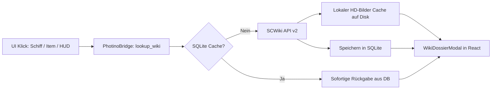

# 🚀 SCLogMate — Feature Roadmap & ToDo-Liste

Dieses Dokument sammelt geplante Erweiterungen, Optimierungen und Feature-Konzepte für zukünftige Versionen von **SCLogMate**.

---

## 🎯 Prioritäre ToDo: UI/UX Angleichung an SCLogMate RC2 (React + Photino)

Entscheidung getroffen: **Wir bleiben bei React + Photino.NET**. Die folgenden Schritte gleichen das React-Frontend Schritt für Schritt an das vertraute, hochdichte Star-Citizen-HUD-Design der Release-Candidate-Version (RC2) an:

- [x] **Schritt 1: Globaler Rahmen, Master-Header & 2-Zeilen-HUD (Shell)**
  - **Oberste Leiste:** Star Citizen Prozess-Status Badge (`● LIVE` / `○ Offline`), Overlay-Schnellstarter (`🖥 Mini-HUD`, `🛰 RS-Overlay`), Sprachwähler mit echten Länderflaggen (DE / EN) und Versions-Pill.
  - **mobiGlas Session-Strip:** Prominenter Session-Auswahlbalken direkt unter dem Header mit Dropdown aller erfassten Spielsitzungen und leuchtender Zeitspannen-Pille (`SessionSpanText`).
  - **Permanentes 2-Zeilen SC-HUD (oben, einklappbar):**
    - *Zeile 1:* Pilot & Server (Region, Shard-Nummer, SC-Version) · Standort & Jurisdiktion (mit leuchtendem Waffenruhe/Armistice-Badge) · Aktives Schiff (Hersteller, Typ, Status).
    - *Zeile 2:* Kontostand & Saldo (Live-aUEC, Session-Delta, OCR-Badge) · Aktiver Auftrag / Mission · Flugdaten & Telemetrie.
    - Einklapp-Funktion per Toggle für maximalen Platz bei Karten & Tabellen.
- [x] **Schritt 2: Chronik & Ereignisse (`EventsView.tsx`)**
  - Dichte, tabellarische Darstellung der Ereignisse mit farbigen Event-Pills (Finanzen, Kampf, Schiffe, Missionen, Orte).
  - Such- und Filterleiste wie in RC2 inkl. ausziehbarem Detail-Drawer mit Rohdaten.
- [x] **Schritt 3: Finanzen & Saldo (`FinancesView.tsx`)**
  - Angleichung der Bilanzkarten (Gesamtguthaben, Sitzungs-Delta, Handelsgewinne).
  - Zeitverlaufs-Chart und tabellarisches Transaktionsbuch für aUEC-Transfers und Rohstoffeinkäufe/-verkäufe.
- [x] **Schritt 4: Lagerbestand / Warehouse (`WarehouseView.tsx`)**
  - Exakte Zwei-Spalten-Struktur: Links Planeten & Raumstationen mit Item-Zählern, rechts Artikeltabelle.
  - Direkte In-Grid Schnellanpassungen (`+` / `-`) und Frachtaufzug-Aktionen (`📦 Per Frachtaufzug entnehmen`, `🔧 Zerlegt`, `Standort leeren`).
- [x] **Schritt 5: Flotte, Aufträge, Ansehen & weitere Detail-Views**
  - Schrittweise Angleichung von Typografie, Tabellenstilen und Informationsdichte an die Avalonia-Vorlage.
  - Automatischer Wechsel nach Datenbank-Synchronisation (`DbUpdateModal.tsx`): 3s-Countdown mit "Weiter (3s)"-Button, der nach Abschluss des Syncs selbsttätig in die App übergeht.

---

## 🗺 1. Starmap & Navigation (Sternenkarte)
- [x] **Sprungreise- & Flugzeit-Rechner (Vector Route):**
  - Zeichnen einer dynamischen Fluglinie vom aktuellen Spieler-Standort zum ausgewählten Zielobjekt auf dem Radar.
  - Berechnung der echten Distanz in Gigametern (GM) und Kilometern.
  - Schätzung der Reisezeit basierend auf konfigurierbaren Sprungantrieben (z. B. S1 Atlas/VK-00, S2 Crossfield, S3 TS-2).
- [x] **Vollständiges Lagrange-Netzwerk (L1 – L5):**
  - Ergänzung aller Lagrange-Stationen rund um Hurston, Crusader, ArcCorp und microTech (*HUR-L1 bis L5, CRU-L1/L4/L5, ARC-L1 bis L4, MIC-L1 bis L5*).
  - Visuelle Badges für Stations-Spezialisierungen (*Raffinerie, Frachtzentrum, Rest Stop, Klinik*).
- [x] **Inter-System Sprungtor-Netzwerk (Jump Gates):**
  - Visuelle Tunnelsysteme zwischen Stanton, Pyro und Nyx.
  - 1-Klick Systemwechsel bei Klick auf ein Sprungtor.
  - Anzeige von Tor-Größen (*S / M / L*) und Transit-Details.
- [x] **Sicherheits- & Gefahrenzonen-Overlays:**
  - Farbcodierte visuelle Zonen für UEE-Waffenruhe (Grün/Cyan) vs. gesetzlose Piraten-Sektoren (Rot/Orange, z. B. GrimHEX, Ruin Station).
- [x] **Rohstoff- & Mining-Hotspots:**
  - Filterbare Markierung von Planeten und Asteroidengürteln mit Vorkommen (*Quantanium, Gold, Beryll, RMC-Wracks*).
- [x] **Pop-out Navigations-Großfenster & Immersives Vollbild:**
  - Separates, maximierbares Starmap-Fenster für Multimonitor-Setups sowie 1-Klick Ausblenden der oberen Dashboard-Karten für maximale Arbeitsfläche.

---

## 📜 2. Log-Parsing & Ereignis-Erkennung
- [x] **Erweiterte Fahrzeug- & Schiffs-Ereignisse:**
  - Präzise Erfassung von Schiffszerstörungen, Selbstzerstörung, Versicherungs-Claims, ATC-Landefreigaben und Fracht-/Schiffsaufzügen (SC 4.x Freight & Ship Elevators).
- [x] **Fraktionsruf & Rufstufen-Tracking:**
  - Automatische Berechnung von Rufstufen bei Auftraggebern (*Bounty Hunters Guild, Northrock, Crusader Security, Hurston Sec, microTech Sec, BlacJac, CDF, Red Wind, United Cargo, Covalex, Recco, Twitch, Wallace Klim, Clovus, Ruto*) anhand abgeschlossener Missionen inkl. Stufenfortschritt (Rang 1 bis 6) & SQLite-Persistenz.
- [x] **Gruppen- & Mehrspieler-Erweiterungen:**
  - Automatisches Erfassen von Gruppen-Belohnungen, Crew-Zusammensetzung und geteilten Missionen.
- [x] **Veredelungs- & Raffinerie-Tracking:**
  - Log-Erkennung von Veredelungsaufträgen und Statusmeldungen.

---

## 🥋 3. Piloten-Ausrüstung & Loadout
- [x] **Waffen-Aufsätze & Modifikationen:**
  - Erkennung von Visieren, Schalldämpfern, Kompensatoren und Magazingrößen an ausgerüsteten Primär- und Sekundärwaffen.
- [x] **Rüstungsklassen & Umgebungsschutz:**
  - Anzeige von Rüstungstypen (*Leicht, Mittel, Schwer, Hazmat, Fliegeranzug*) sowie Temperaturwiderständen (-225°C bis +225°C) und Schadenswiderständen (20% bis 40%) im Ausrüstungs-Tab.
- [x] **Loadout-Export & Sharing:**
  - 1-Klick Export der aktuellen Ausrüstung als Text für Discord / Zwischenablage sowie formatierter Markdown-Report (`.md`) für Org-Einsätze und Flotten-Briefings.

---

## 💰 4. Handel, Wirtschaft & Finanzen
- [x] **Raffinerie-Timer & Benachrichtigungen:**
  - Visueller Live-Countdown für aktive Veredelungsaufträge (*Station, Material, Methode, Ertrag, Status*) mit automatischer Toast-Benachrichtigung bei Fertigstellung.
- [x] **Handelsrouten-Empfehlungen & Profit-Kalkulator:**
  - Katalog profitabler Fracht- & Handelsrouten für Stanton & Pyro inkl. Echtzeit-Gewinnberechnung je nach Schiffsladekapazität (SCU).
- [x] **Flotten-Gesamtwert & Hangar-Verzeichnis:**
  - Schätzung des Gesamtwerts aller im Hangar geflogenen Schiffe in aUEC sowie Zählung individueller Flüge und QT-Sprünge.
- [x] **Loot- & Beute-Wert-Schätzer:**
  - Automatische Bepreisung erbeuteter Ausrüstung und Waffen anhand gängiger In-Game Händlerpreise.

---

## 🗔 5. In-Game Overlays & System
- [x] **Globaler Hotkey (`Alt + H`):**
  - Schnelles Ein-/Ausblenden des Mini-HUDs direkt im Vollbild-Spiel per systemweitem Tastenkürzel (`Alt + H`), ohne aus dem Spiel tappen zu müssen.
- [x] **HUD-Sperre (Click-Through & Position-Lock):**
  - Verriegeln des Mini-HUDs gegen versehentliches Verschieben sowie Click-Through Modus (`WS_EX_TRANSPARENT`).
- [x] **Modulare Toast-Kategorien & Soundeffekt:**
  - Granulare Checkboxen für alle Toast-Typen (*Baupläne, Missionen, Fraktions-Beförderungen, Raffinerie, Aufzüge, Schiffszerstörung*) inkl. dezentem Audio-Soundeffekt.
- [x] **Multi-Monitor Profiling:**
  - Automatisches Speichern und Wiederherstellen separater Overlay-Positionen.

---

## 🌐 6. Star Citizen Wiki (SCWiki) Vollintegration & Lokaler Cache

### 🎯 Das Ziel: 100% In-App SCWiki-Integration mit Offline-Cache & HD-Bildern

### 📝 Aufgaben für die SCWiki-Vollintegration:
- [ ] **Lokaler HD-Bilder- & Asset-Cache (`Core/WikiImageCache.cs`):**
  - Download und dauerhaftes Speichern aller Render-Bilder und Thumbnails unter `%APPDATA%\SCLogMate\cache\wiki\images\{hash}.webp`.
  - Bereitstellung der lokalen Cachedateien für das React-Frontend (über Base64 Data-URIs oder lokales Dateiprotokoll).
  - Automatischer Fallback: Falls offline oder noch nicht gecacht, wird das Remote-CDN geladen und parallel im Hintergrund gecacht.
- [ ] **Erweiterter SQLite-Speicher (`Core/Database.cs`, Schema v20):**
  - **Neue Tabelle `wiki_vehicles_cache`:**
    - Speicherung vollständiger Schiffsspezifikationen: *Rolle, Typ, Fokus, Hersteller, Besatzung (Min/Max), Frachtkapazität (SCU), Quantum-Treibstoff-Kapazität, Triebwerke, Waffen-Hardpoints, Schilde, Kühler, Abmessungen (L×B×H, Masse), Pledge-Preis (MSRP) und deutscher Beschreibungstext*.
  - **Bestehende Tabelle `wiki_items_cache` erweitern um:**
    - Schadenswerte, Feuerrate, Rüstungsklasse, Temperaturwiderstände, Item-Grade und Typ.
- [ ] **Backend IPC-Bridge (`Core/Photino/PhotinoBridge.cs`):**
  - Neuer Handler `lookup_wiki`: Sucht Schiffe oder Items anhand Name oder interner CIG-Klasse (`grin_utility_medium_helmet_01_01_04`).
  - Neuer Handler `search_wiki`: Volltextsuche über Schiffe, Fahrzeuge, Waffen, Rüstungen und Module.
  - Neuer Handler `get_wiki_specs`: Liefert strukturierte Datenblätter für Schiffe und Ausrüstung.
- [ ] **Interaktives SCWiki-Dossier-Modal (`frontend/src/components/WikiDossierModal.tsx`):**
  - Modernes Star-Citizen-Glassmorphism-Modal direkt in der App:
    - **HD-Header:** Vollbild-Render des Schiffs/Items mit Hersteller-Logo und Kategorie-Pill.
    - **Lore & Beschreibung:** Deutsche Übersetzung priorisiert, mit Umschalter auf Original-Englisch.
    - **Spezifikationen-Grid:** Kacheln für Besatzung, Fracht (SCU), Schild-Größen, Quantum Drive, Waffen/Türme.
    - **Kauf- & Mietorte:** Wo im Verse (z. B. *New Deal*, *Astro Armada*, *Cousin Crows*) ist das Schiff/Item für aUEC erhältlich?
    - **Externer Link:** Direkter Button zum Öffnen des Eintrags im echten Wiki (`starcitizen.tools` / `star-citizen.wiki`).
- [ ] **Nahtlose Einbindung an allen Berührungspunkten in der UI:**
  - **Startseite / HUD (Karte 3 - Aktives Schiff):** Klick auf „Wiki“ öffnet das Schiffsdossier-Modal.
  - **Flotten-Manager (`FleetView.tsx`):** Klick auf ein beliebiges Schiff öffnet das vollständige SCWiki-Datenblatt.
  - **Lagerbestand (`WarehouseView.tsx`):** Klick auf Gegenstand oder Aktionsmenü „Im Wiki anzeigen“ öffnet das Item-Dossier.
  - **Ereignis-Chronik (`EventsView.tsx`):** Kontextmenü / Button bei Log-Einträgen mit Schiffen oder Beute.
  - **Ausrüstung & Baupläne (`LoadoutView.tsx`, `BlueprintsView.tsx`):** Klick auf Waffen/Rüstungen/Komponenten öffnet das SCWiki-Dossier.
- [ ] **Eigener SCWiki-Browser / Explorer (Neuer Reiter oder Untermenü):**
  - Katalog aller Star-Citizen-Schiffe, -Fahrzeuge und -Waffen mit Live-Suche, Herstellerfiltern (Anvil, Drake, RSI, Aegis, Origin etc.) und Direktansicht.

---

## 💬 7. In-Game Chat-Verlauf & OCR-Protokollierung (Player Reports)
- [ ] **OCR-basierte Chat-Erfassung (`Core/Ocr/ChatOcrScanner.cs`):**
  - Dedizierte, ressourcenschonende OCR-Erfassung des Star Citizen Chat-Fensters (Global, Party, Direct Message, Channel).
  - Robust gegen variierende Transparenzen, Chat-Schriftarten und Hintergründe.
- [ ] **Strukturierte Chat-Chronik mit Zeitstempel & User-ID (`Core/Database.cs`):**
  - Automatisches Parsen von:
    - **Präziser Zeitstempel** (`[YYYY-MM-DD HH:mm:ss]`).
    - **Sender / Spielername** (`User / Handle`) inkl. Farb-/Kanal-Zuordnung (Global / Party / Flüstern).
    - **Kanal-Kennung** (`Global`, `Party`, `Direct`).
    - **Vollständiger Nachrichten-Text**.
  - Speicherung in dedizierter SQLite-Tabelle `chat_messages` mit Indizes auf Zeitstempel und Spielername.
- [ ] **Chat-Chronik & Such-Explorer in der UI (`frontend/src/views/ChatLogView.tsx`):**
  - Durchsuchbarer Chat-Verlauf mit Live-Volltextsuche und Spieler-Filter (z. B. alle Nachrichten eines bestimmten Spielers isolieren).
  - Schnellauswahl nach Zeitraum / Spielsitzung.
- [ ] **1-Klick CIG Support-Report Export:**
  - Einfaches Zusammenstellen und Exportieren von Vorfällen (Griefing, Beleidigungen, Belästigung, Erpressung, Piraterie) für den RSI / CIG Player Support.
  - Formatierte Zusammenfassung mit exakten Zeitstempeln, Shard-ID, Server-Region, Spielernamen, wörtlichem Chatprotokoll und optionalem Screenshot-Auszug als saubere Text-/Markdown-Vorlage für das Support-Ticket.

---

## 🕹 8. Ausstehende RC2-Parität (Avalonia vs. Photino)

Im Vergleich zur Avalonia-Version (RC2) sind die meisten Kernbereiche (Chronik, Flotte, Finanzen, Starmap, Lager, Blackbox, Baupläne, Werkzeuge) bereits in React/Photino portiert. Folgende spezialisierte RC2-Features fehlen noch bzw. werden schrittweise überführt:

| Bereich | RC2 (Avalonia) | Photino (Aktueller Stand) | Status / ToDo |
|---|---|---|---|
| **SCWiki In-App Overlay** | Integriertes Modal mit Bild, Specs & deutscher Lore | Nur externer Browser-Link (`target="_blank"`) | 🔴 Fehlt in Photino (Abschnitt 6) |
| **Lokaler SCWiki Bild-Cache** | Nur Remote-URLs (kein permanenter Disk-Cache) | Keiner | 🔴 Fehlt komplett (Abschnitt 6) |
| **Floating Mini-HUD Overlay (`Alt+H`)** | Separates, transparentes, rahmenloses Always-on-Top Win32-Fenster mit Click-Through Modus direkt über dem Vollbild-Spiel | Nur Web-Dashboard im Hauptfenster | 🟡 Pop-out / Win32 Overlay fehlt noch |
| **RS-Scan Overlay Window** | Separates transparentes Radar-/Signatur-Fenster über dem Spiel | Nur als View im Hauptfenster (`OreScannerView.tsx`) | 🟡 Transparenter In-Game-Modus fehlt |
| **OCR Screen-Region-Selector** | Interaktiver Rahmen auf dem Desktop zum Zeichnen/Justieren der Scan-Region für Kontostand & Aufträge | Koordinaten-Eingabe in Settings | 🟡 Visueller Desktop-Drag-Selector fehlt |
| **Scan Indicator Window** | Grüner/Gelber visueller Flash-Indikator am Monitorrand bei OCR-Erfassung | Kein sichtbares Feedback am Desktop | 🟡 Desktop-Flash fehlt (nur Web-Status) |
| **In-Game Desktop Toasts** | Transparente native Toasts über dem Spielfenster für Aufzüge, Schiffszerstörung, Missionsabschluss | Nur interne Web-Toasts innerhalb der App | 🟡 Desktop-Always-On-Top Toasts fehlen |
| **Rechtsklick-Kontextmenüs** | Kontextmenüs auf allen Tabellenzeilen (*Im Wiki nachschlagen, Zeile kopieren, Filter setzen*) | Meist nur Klick-Auswahl oder Detail-Drawer | 🟢 In React nachrüstbar |
| **DB-Diagnose & Schnell-Reparatur** | Visuelle Tabelle mit Prüfung aller Spalten, Tabellen, Indizes und `PRAGMA quick_check;` | Basis-Tools vorhanden | 🟢 UI-Angleichung an RC2-Diagnose |

---

## 🚀 Empfohlene nächste Umsetzungsschritte

- [ ] **Schritt 1 (SCWiki Backend & Cache):**
  - Implementierung von `Core/WikiImageCache.cs` (Disk-Cache für Render-Bilder unter `%APPDATA%\SCLogMate\cache\wiki\images\`).
  - Tabelle `wiki_vehicles_cache` in `Database.cs` (Schema v20) für strukturierte Fahrzeug-Spezifikationen.
  - Erweiterung von `WikiApiClient.cs` & `PhotinoBridge.cs` um `lookup_wiki`.
- [ ] **Schritt 2 (SCWiki UI Modal & Trigger):**
  - Erstellung des React-Modals `WikiDossierModal.tsx` mit HD-Bildern, deutscher Übersetzung und Spezifikationen-Kacheln.
  - Anbindung an das HUD (Schiffskarte), die Flotte (`FleetView.tsx`) und das Lager (`WarehouseView.tsx`).
- [ ] **Schritt 3 (SCWiki Explorer / Suche):**
  - Eine Suchmaske zum Durchstöbern aller Schiffe, Fahrzeuge und Gegenstände des Star Citizen Wikis direkt in SCLogMate.

